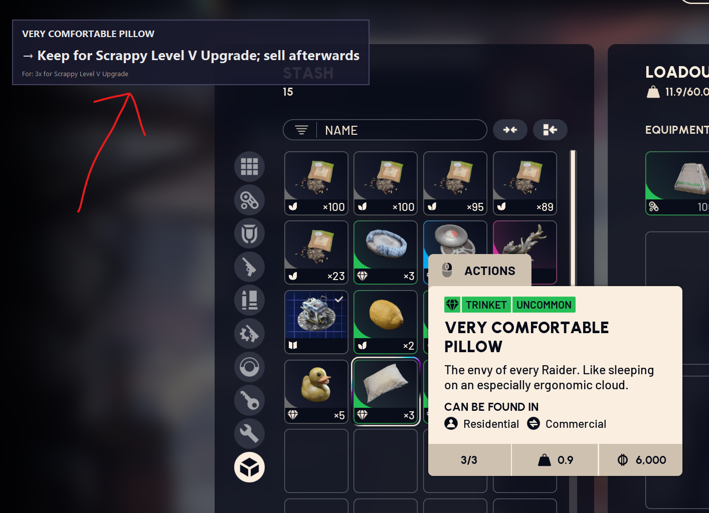

# Arc Raiders Helper

A screen overlay tool that helps you manage your inventory in Arc Raiders by automatically detecting items and displaying recommended actions (keep, recycle, etc.).




A video of how the tool works:
- TODO: add youtube link

---

## Table of Contents

- [How It Works](#how-it-works)
- [Features](#features)
- [Requirements](#requirements)
- [Installation](#installation)
- [First Run Setup](#first-run-setup)
- [Calibration Tool](docs/CALIBRATION.md)
- [Configuration](docs/CONFIGURATION.md)
- [Item Database](docs/ITEMS.md)
- [Building from Source](docs/BUILD.md)
- [Troubleshooting](docs/TROUBLESHOOTING.md)
- [Contributing](#contributing)
- [Changelog](docs/CHANGELOG.md)

---

## How It Works

The tool uses a two-phase detection system:

```
┌─────────────────────────────────────────────────────────────────┐
│                                                                 │
│  Phase 1: TRIGGER DETECTION (low frequency, every 500ms)        │
│  ─────────────────────────────────────────────────────────      │
│  Scans specific screen regions looking for "INVENTORY" text     │
│  This indicates that the inventory is open                      │
│                                                                 │
│                          │                                      │
│                          ▼                                      │
│              ┌───────────────────────┐                          │
│              │  INVENTORY detected?  │                          │
│              └───────────┬───────────┘                          │
│                    YES   │                                      │
│                          ▼                                      │
│                                                                 │
│  Phase 2: TOOLTIP DETECTION (high frequency, every 300ms)       │
│  ─────────────────────────────────────────────────────────      │
│  Captures area around cursor → Finds tooltip → Extracts         │
│  item name via OCR → Looks up in database → Shows overlay       │
│                                                                 │
└─────────────────────────────────────────────────────────────────┘
```

TODO: add screenshots

### Detection Details

1. **Trigger Detection**: Continuously scans two screen regions (menu mode and in-raid mode) looking for the word "INVENTORY". This indicates that you have opened your inventory in the game.

2. **Tooltip Detection**: Once the inventory is detected, the tool starts scanning the area around your mouse cursor for item tooltips. When you hover over an item, it:
   - Captures a region around your cursor
   - Identifies the tooltip by its cream-colored background
   - Filters out colored tags (rarity, item type)
   - Extracts the item name using OCR

3. **Overlay Display**: If the item is found in the database, an overlay appears showing the recommended action (e.g., "KEEP - needed for crafting" or "RECYCLE - not useful").

---

## Features

- **Automatic detection** - No hotkey needed, detects when inventory is open
- **Cursor-following** - Finds tooltips wherever they appear on screen
- **Two-phase scanning** - Minimizes CPU usage by only running tooltip OCR when inventory is open
- **Resolution profiles** - Pre-configured settings for common screen resolutions
- **Calibration tool** - GUI tool to configure screen regions for any resolution
- **OCR-based** - Reads item names directly from screen using Tesseract
- **SQLite database** - Load items from CSV files
- **Configurable** - All settings stored in `.env` file
- **Debug mode** - Saves intermediate images for troubleshooting OCR issues
- **Bundled Tesseract** - Pre-built releases include Tesseract (no separate install needed)

---

## Requirements

### To Run Pre-built Release

- Windows 10/11
- Arc Raiders running in **borderless windowed** or **windowed** mode (not fullscreen)

### To Run from Source

- Windows 10/11
- Python 3.11 or higher
- [uv](https://github.com/astral-sh/uv) package manager (recommended) or pip
- [Tesseract OCR](https://github.com/UB-Mannheim/tesseract/wiki) installed

### To Build from Source

- All of the above, plus:
- PyInstaller (`uv sync --all-extras`)

---

## Installation

### Option 1: Pre-built Release (Recommended)

1. Download the latest release from the [Releases](https://github.com/yourusername/arc-raiders-helper/releases) page
2. Extract the zip file to a folder of your choice
3. Run `ArcRaidersHelper.exe`

The release includes all dependencies, including Tesseract OCR.

### Option 2: From Source

1. Clone the repository:
   ```bash
   git clone https://github.com/yourusername/arc-raiders-helper.git
   cd arc-raiders-helper
   ```

2. Install dependencies:
   ```bash
   uv sync
   ```

3. Install Tesseract OCR:
   - Download from [UB Mannheim](https://github.com/UB-Mannheim/tesseract/wiki)
   - Install to `C:\Program Files\Tesseract-OCR\`
   - Or set `TESSERACT_PATH` in `.env` to your installation path

4. Copy the example configuration:
   ```bash
   cp .env.example .env
   ```

5. Run the application:
   ```bash
   uv run arc-helper
   ```

---

## First Run Setup

On first launch, the application will:

1. **Detect your screen resolution**
2. **Check for a pre-configured profile** for your resolution
3. **If found**: Automatically apply the settings and start
4. **If not found**: Display a message asking you to run the Calibration tool

### Supported Resolutions

The following resolutions have pre-configured profiles:

| Resolution | Aspect Ratio | Status |
|------------|--------------|--------|
| 3440x1440 | 21:9 (Ultrawide QHD) | ✅ Configured |
| 2560x1440 | 16:9 (QHD) | ✅ Configured |
| 1920x1080 | 16:9 (Full HD) | ✅ Configured  |
| 3840x2160 | 16:9 (4K UHD) | ⚠️ Needs calibration |
| 2560x1080 | 21:9 (Ultrawide FHD) | ✅ Configured  |

If your resolution isn't listed or shows "Needs calibration", run the [Calibration tool](docs/CALIBRATION.md) to configure it.

**NOTE:** if you want to force the app to load up a resolution config from the pre-configured resolutions, you need to:

- run the [Calibration tool](docs/CALIBRATION.md)
- hit `Reset to Defaults`
- hit `Save Configuration`
- re-run the main app


## Contributing

Contributions are welcome! Here's how you can help:

### Resolution Profiles

If you calibrate the app for a new resolution, please submit the values! This helps other users with the same resolution.

1. Run the Calibration tool and find working values for your resolution
2. Open `resolutions.json` and add your resolution's profile
3. Submit a pull request

### Item Database

Help build a comprehensive item database:

1. Create or update item entries in CSV format
2. Test that the items are detected correctly
3. Submit your CSV additions

### Bug Reports

When reporting issues, please include:

- Your screen resolution
- Debug images from the `debug/` folder (if applicable)
- The `arc_helper.log` file (enable debug mode first)
- Steps to reproduce the issue

---

## Project Structure

```
arc-raiders-helper/
├── pyproject.toml              # Package configuration
├── build.py                    # Build script for PyInstaller
├── ArcRaidersHelper.spec       # PyInstaller spec file
├── .env.example                # Example configuration
├── sample_items.csv            # Sample item data
├── README.md                   # This file
├── src/arc_helper/
│   ├── __init__.py
│   ├── config.py               # Settings and logging setup
│   ├── logging_config.py       # Logging configuration
│   ├── database.py             # SQLite database and CSV import
│   ├── ocr.py                  # Screen capture and OCR
│   ├── overlay.py              # Tkinter overlay window
│   ├── resolution_profiles.py  # Resolution-based configuration
│   ├── resolutions.json        # Pre-configured resolution profiles
│   ├── main.py                 # Main application entry point
│   └── calibrate.py            # Calibration tool
└── test_*.py                   # Test scripts
```

---

## License

MIT License - Free to use and modify.

---

## Acknowledgments

- [Tesseract OCR](https://github.com/tesseract-ocr/tesseract) for text recognition
- [PyInstaller](https://pyinstaller.org/) for executable packaging
- [Pydantic](https://docs.pydantic.dev/) for configuration management
- Arc Raiders community for item information
